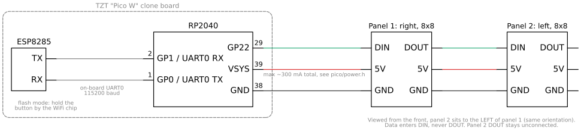

# Firmware for the RP2040 + ESP8285 "Pico W" clone

Some cheap "Raspberry Pi Pico W" boards on AliExpress (e.g. sold by TZT) are not
Pico Ws: instead of the Infineon CYW43439 they carry an **ESP8285** WiFi chip
wired to the RP2040's UART0. Official Pico W firmware, MicroPython's `network`
module and the pico-sdk `cyw43` driver all fail on them (`[CYW43] Failed to start CYW43`).

The board actually has two microcontrollers. This repo programs both, with each one doing what it's good at:

| Chip | Code | Job |
|---|---|---|
| **RP2040** | `pico/`: C, pico-sdk 2.2 | 16x8 WS2812 display (two 8x8 panels): text rendering, scroll timing, PIO output |
| **ESP8285** | `esp/`: PlatformIO, ESP8266 Arduino core | WiFi, web UI, telemetry, OTA updates |

There is no AT firmware here. The ESP runs its own program, and the two chips exchange text lines over UART.
**The application:** a 16x8 WS2812 display on GP22, made of two chained 8x8 panels, that you control from your browser.
- **Scrolling text:** set the text, color, speed and brightness. "Surprise me" spreads a rainbow across the string.
- **Clock:** 24-hour `HH MM` in a 3x5 font, with a seconds bar along the bottom row. The time comes from NTP on the ESP (time zone: `TZ_INFO` in `esp/src/main.cpp`, default Europe/Berlin).
- **Timers:** set minutes and seconds, or use the 1/5/10/25-minute quick buttons. The display counts down `MM SS` (or `H MM` from one hour up), with the bar showing time left. At zero it flashes for 10 s, then goes back to the clock.
- **Images:** pick any image. The browser crops it to a 2:1 strip, shrinks it to 16x8 and gamma-corrects it, then the display shows it.

On boot the display shows the clock; `-- --` means it hasn't got the time yet (no WiFi or NTP).

The Pico handles all display timing, so scrolling stays smooth whatever WiFi is doing.

## Hardware

| Signal | RP2040 | ESP8285 |
|---|---|---|
| UART TX → RX | GP0 | RX |
| UART RX ← TX | GP1 | TX |
| WS2812 data (array **DIN**) | GP22 | — |

Display layout is configured at the top of `pico/main.c`:
- `PANELS`, `PANEL_W`: how many 8x8 panels sit side by side.
- `RIGHT_FIRST`: GP22 feeds the rightmost panel, whose DOUT feeds the next one to its left. Set it to 0 if the halves come out swapped.
- `SERPENTINE`, `FLIP_X`, `FLIP_Y`: wiring within a panel. The defaults assume LED 0 at the bottom right and every row running the same way. If text comes out mirrored or upside down, flip the matching knob.

The array is powered from VSYS, so `pico/power.h` caps the estimated LED current at
300 mA by scaling whole frames. Change `LED_BUDGET_MA` / `LED_MA_PER_CHANNEL` to match your supply.

## UART protocol (115200 8N1, `\n`-terminated)

| Direction | Line | Meaning |
|---|---|---|
| ESP → Pico | `WIFI <0\|1> <ip>` | every 1 s; on first connect the Pico scrolls the IP |
| ESP → Pico | `TEXT <rrggbb> <speed> <rainbow 0\|1> <text>` | scroll text, speed in columns/s (1–60); rainbow spreads hues over the string |
| ESP → Pico | `IMG <768 hex>` | 16x8 frame, `rrggbb` per pixel, row-major from top-left |
| ESP → Pico | `TIME <secs>` | local seconds since midnight, sent on each new NTP second |
| ESP → Pico | `CLOCK <rrggbb>` | show the clock |
| ESP → Pico | `BRIGHT <percent>` | global brightness, sent on change and every second |
| ESP → Pico | `TIMER <secs> <rrggbb>` | start a countdown (the Pico times it); `0` cancels |
| Pico → ESP | `T <text>` | telemetry, served at `/telemetry` |

Unknown lines are ignored, which covers the ESP's boot-ROM noise. On the Pico, UART RX is interrupt-driven into a ring buffer, so the main loop never blocks on the ESP.

## Web (http://pico-esp.local)

- `/`: the control page
- `/text?s=Hello&c=00ff40&v=12&r=0`: scroll text (`c` = color, `v` = columns/s, `r=1` = rainbow)
- `/bright?b=5`: global brightness in percent (1–100); `/bright` alone returns the current value
- `/clock?c=ff8000`: show the clock
- `/timer?s=300&c=ff8000`: 5-minute timer (`s=0` cancels, max 86400)
- `/img?d=<768 hex>`: show a 16x8 frame (128 × `rrggbb`, row-major from the top-left). This is the API for driving the display from your own code.

Colors everywhere are **perceptual**, like a color picker: send `ff8000` for orange at any brightness.
The Pico maps each channel through a gamma curve (`GAMMA 2.2` in `pico/main.c`), because WS2812 light output
is linear in the value sent while the eye isn't. It then applies the global brightness (`/bright`) and the
300 mA cap. Without the gamma step, mixed colors drift: orange comes out yellowish, for example.
At low brightness only a few levels remain on the LED side, so very dark colors round to off.
The API handles about 11 frames/s (≈90 ms per request). Most of that time is the 115200-baud UART, so raising the baud rate is the next speed-up.
- `/telemetry`: latest Pico telemetry line

## Demos (`demos/`, Python standard library only)

These drive the display only through the HTTP API:

    python3 demos/pong.py              # computer vs computer pong, first to 5
    python3 demos/pong.py --selftest   # game logic only, no network
    python3 demos/breath.py 30         # calm full-panel yellow breathing for 30 s

## Build & flash

Needs pico-sdk 2.2.0 (e.g. via the Raspberry Pi Pico VS Code extension, in `~/.pico-sdk`) and PlatformIO.

**Pico:**

    cd pico && cmake -S . -B build -G Ninja && ninja -C build
    picotool load -f -x build/pico_wifi_display.uf2   # first time: BOOTSEL + copy the .uf2

**ESP**, after the first serial flash, over WiFi:

    cp esp/src/secrets.h.example esp/src/secrets.h    # your SSID / password
    cd esp && pio run -e ota -t upload

### First ESP flash (serial, one time)

The ESP8285's UART only reaches USB through the RP2040, so the Pico has to act as a USB-serial bridge:

1. Flash `Serial_port_transmission.uf2` from [JiriBilek/RP2040_PicoW_ESP8285_Library](https://github.com/JiriBilek/RP2040_PicoW_ESP8285_Library/tree/main/firmware) to the Pico.
2. Unplug, hold the button **near the WiFi chip** (ESP GPIO0), plug back in.
3. `cd esp && pio run -t upload` (set `upload_port` in `platformio.ini`; uses DOUT flash mode)
4. Hold BOOTSEL, replug, copy `pico/build/pico_wifi_display.uf2` to the RPI-RP2 drive.

To go back to AT firmware, flash
[ESP_ATMod](https://github.com/JiriBilek/ESP_ATMod) the same way and use
JiriBilek's MicroPython library.

## Next steps

- Move the realtime work to core 1 (`multicore_launch_core1`).
- Move the LED updates to DMA. They currently block for about 30 µs per LED.
- Support non-ASCII text (currently shown as `?`); `font8x8_ext_latin.h` covers Latin-1.
- Push telemetry from the ESP to an internet service (MQTT etc.).

## Credits

- [mocacinno/rp2040_with_esp8285](https://github.com/mocacinno/rp2040_with_esp8285) and
  [JiriBilek/RP2040_PicoW_ESP8285_Library](https://github.com/JiriBilek/RP2040_PicoW_ESP8285_Library)
  worked out how to use these boards.
- `pico/ws2812.pio` © Raspberry Pi Ltd, BSD-3-Clause.
- Wiring diagram drawn with [schemdraw](https://schemdraw.readthedocs.io/) (`docs/wiring.py`).
- `pico/font8x8_basic.h` from [dhepper/font8x8](https://github.com/dhepper/font8x8), public domain.

## License

MIT
